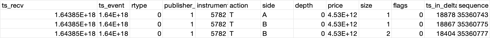
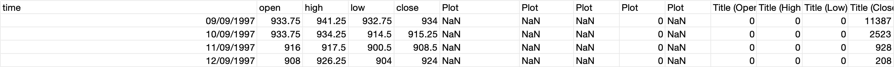
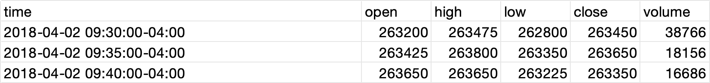

# trade-data-preprocess

A data preprocessing pipeline for normalizing timestamps, extracting related trade records,
and generating aggregated OHLCV bars from raw trade data.

---

## Pipeline Overview

This project implements a three-stage data preprocessing pipeline:

### Stage 1: Timestamp Normalization(Optional)

Standardize the `ts_event` column across all input files to ISO 8601 format.

- Handles inconsistent timestamp formats

---

### Stage 2: Trade Record Extraction and Consolidation

For each trading date in the reference file:

- Identify related raw trade files from the input directory
- Extract trade records associated with the given date
- Combine extracted records into a single dataset
- Enforce unified data types
- Save the result as a Parquet file

This stage produces clean, date-partitioned Parquet trade files for downstream processing.

---

### Stage 3: OHLCV Aggregation (generate_bars.py)

Generate aggregated OHLCV (Open, High, Low, Close, Volume) bars at configurable time intervals (minute, hour, day).

- Supported aggregation intervals:
  - minute
  - hour
  - day
- Output includes:
  - time
  - open
  - high
  - low
  - close
  - volume

---

## Usage

### Stage 1: Timestamp Normalization
- input:
  - source_folder: folder contains raw csv files downloaded from website.
  - sample input file:
    
  - note: some of the csv files have symbol column, some don't.
  

### Stage 2: Trade Record Extraction and Consolidation

call the function: get_related_trade_records
- input 
  - reference_file_path: reference file is where we distinguish the relevant record.
  - input_folder_path: raw data folder:raw data file are the csv files we get from step 1.
  - output_folder_path: folder that contains all the output files.
  - sample reference file:
    
 
- output files are the parquet files with all the relevant records and separated by date(raw_silver).

---
### Stage 3: OHLCV Aggregation (generate_bars.py)


- input:
  - input_folder_path: Path to the folder containing parquet files with trade record(raw_silver).
  - output_folder_path: Path to the folder where the aggregated parquet file will be saved.
  - sample input parquet file:
```
------------------------------+------------------------------+-----+------------+-------------+------+----+-----+-------------+----+-----+-----------+--------+------+
|ts_recv                       |ts_event                      |rtype|publisher_id|instrument_id|action|side|depth|price        |size|flags|ts_in_delta|sequence|symbol|
+------------------------------+------------------------------+-----+------------+-------------+------+----+-----+-------------+----+-----+-----------+--------+------+
|2018-04-03T22:00:00.003383308Z|2018-04-03T22:00:00.000881048Z|0    |1           |23252        |T     |N   |0    |2612000000000|136 |0    |33597      |16920272|ESM8  |
|2018-04-03T22:00:00.006316155Z|2018-04-03T22:00:00.006018669Z|0    |1           |23252        |T     |A   |0    |2612000000000|1   |0    |19285      |16920306|ESM8  |
|2018-04-03T22:00:00.006687588Z|2018-04-03T22:00:00.006455883Z|0    |1           |23252        |T     |A   |0    |2612000000000|1   |0    |19702      |16920308|ESM8  |
|2018-04-03T22:00:00.008217908Z|2018-04-03T22:00:00.007979893Z|0    |1           |23252        |T     |B   |0    |2612250000000|1   |0    |18657      |16920327|ESM8  |
```
    

- sample output files(5-min agg) looks like the following table but in parquet.

